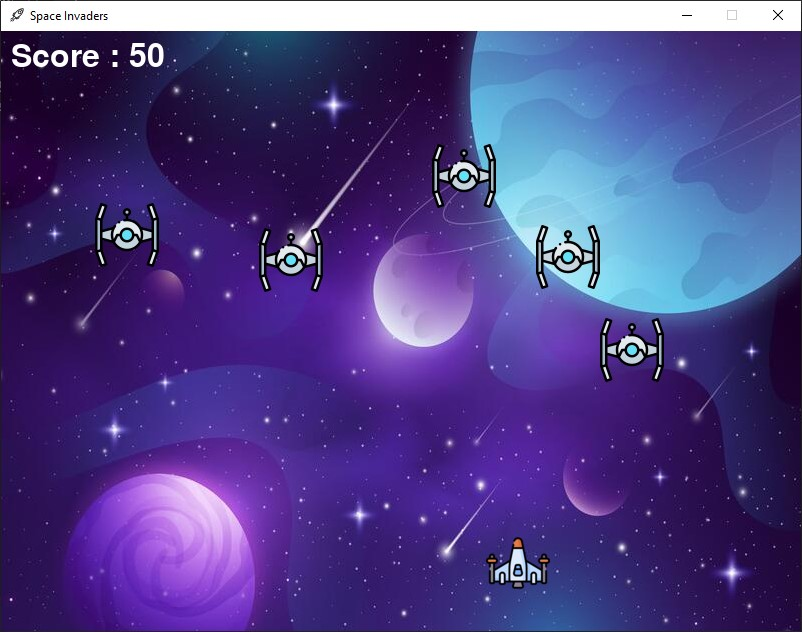

# Space Invaders (Pygame)

A fun arcade-style **Space Invaders** game built using **Python** and **Pygame**. Control your spaceship, shoot incoming enemies, and try to score as high as possible before the game ends!

## Gameplay

- Move the spaceship using:

  - `A` / `D` keys **or**
  - Left / Right arrow keys

- Press `Spacebar` to fire bullets
- Score points by shooting down enemies
- The game ends if any enemy crosses the bottom line

## Features

- Smooth 2D movement and collision detection
- Multiple enemy ships with randomized positions and speeds
- Real-time score tracking
- Game over screen when enemies reach the player zone
- Custom assets: player, enemies, bullet, and background

## Demo



## How to Run

### Prerequisites

- Python 3.x
- `pygame` library

### Installation

Install Pygame using pip if you haven't already:

```bash
pip install pygame
```

### Running the Game

```bash
python main.py
```

Make sure the following image files are present in the same directory:

- `shuttle.png` (player)
- `enemy.png` (enemy)
- `bullet.png` (bullet)
- `newBg.jpg` (background)
- `icon.png` (window icon)
